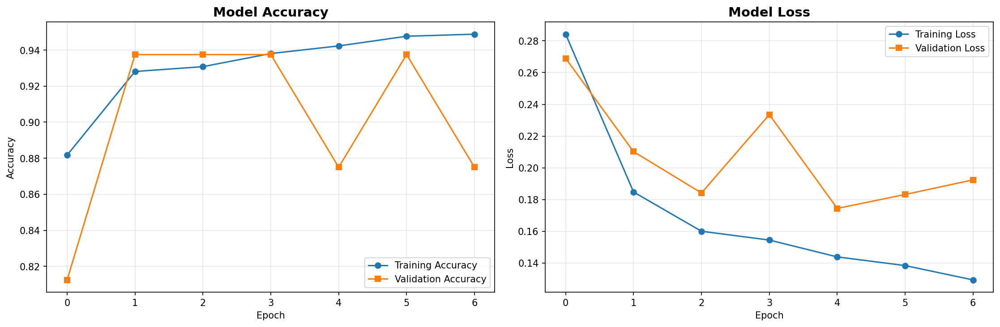
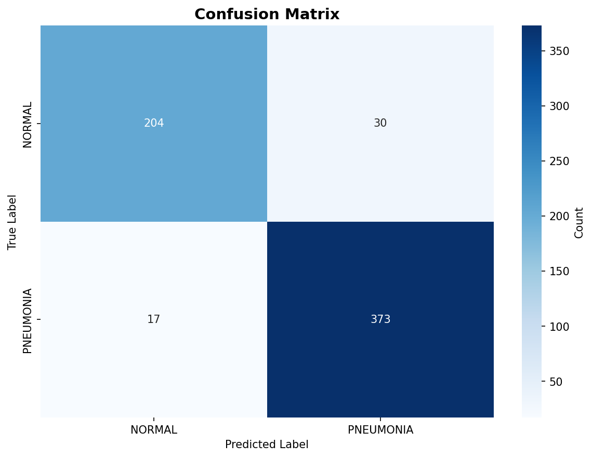

# 🫁 Pneumonia Detection System

An AI-powered application that analyzes chest X-ray images to detect pneumonia using Deep Learning (CNN with Transfer Learning) and provides a user-friendly Streamlit interface.


## 📋 Table of Contents

- [Overview](#overview)
- [Features](#features)
- [Dataset](#dataset)
- [Model Architecture](#model-architecture)
- [Installation](#installation)
- [Usage](#usage)
- [Model Performance](#model-performance)
- [Deployment](#deployment)
- [Project Structure](#project-structure)
- [Screenshots](#screenshots)
- [Technologies Used](#technologies-used)
- [License](#license)

## 🎯 Overview

This project is a complete Pneumonia Detection System developed as part of a Deep Learning assignment. It uses Transfer Learning with MobileNetV2 to classify chest X-ray images into two categories:

- **NORMAL** - Healthy lungs
- **PNEUMONIA** - Lungs affected by pneumonia

The application provides an intuitive web interface built with Streamlit, making it accessible to users without technical expertise.

## ✨ Features

- **AI-Powered Detection**: Uses state-of-the-art deep learning (MobileNetV2) for accurate predictions
- **User-Friendly Interface**: Clean and intuitive Streamlit web application
- **Real-Time Predictions**: Instant analysis of uploaded X-ray images
- **Confidence Scores**: Displays prediction confidence with visual charts
- **Image Preview**: View uploaded images before analysis
- **Educational Purpose**: Designed for learning and understanding medical AI applications
- **Cloud Deployment Ready**: Easily deployable on Streamlit Cloud

## 📊 Dataset

**Source**: [Kaggle - Chest X-Ray Images (Pneumonia)](https://www.kaggle.com/datasets/paultimothymooney/chest-xray-pneumonia)

**Dataset Statistics**:
- Total Images: 5,863 X-ray images (JPEG)
- Categories: 2 (NORMAL, PNEUMONIA)
- Training Set: ~5,200 images
- Validation Set: ~16 images
- Test Set: ~624 images
- Image Format: JPEG
- Image Size: Variable (resized to 224x224 for model)

## 🏗️ Model Architecture

**Base Model**: MobileNetV2 (Pre-trained on ImageNet)

**Architecture Details**:
```
Input Layer (224x224x3)
    ↓
MobileNetV2 Base (Frozen Layers)
    ↓
GlobalAveragePooling2D
    ↓
Dense Layer (128 units, ReLU)
    ↓
Dropout (0.5)
    ↓
Output Layer (2 units, Softmax)
```

**Training Configuration**:
- Optimizer: Adam (learning_rate=0.001)
- Loss Function: Categorical Crossentropy
- Metrics: Accuracy, Precision, Recall
- Batch Size: 32
- Epochs: 20 (with Early Stopping)
- Data Augmentation: Rotation, Zoom, Flip, Shift

**Callbacks**:
- Early Stopping (patience=5)
- Model Checkpoint (save best model)
- Reduce LR on Plateau

## 🚀 Installation

### Prerequisites

- Python 3.9 or higher
- Kaggle Account (for dataset download)
- 4GB+ RAM recommended
- GPU recommended (optional, for faster training)

### Step 1: Clone the Repository

```bash
git clone https://github.com/yourusername/pneumonia-detection-system.git
cd pneumonia-detection-system
```

### Step 2: Create Virtual Environment

```bash
# Windows
python -m venv venv
venv\Scripts\activate

# Linux/Mac
python3 -m venv venv
source venv/bin/activate
```

### Step 3: Install Dependencies

```bash
pip install -r requirements.txt
```

### Step 4: Set Up Kaggle API

1. Go to https://www.kaggle.com/account
2. Click "Create New Token" to download `kaggle.json`
3. Place the file in:
   - Windows: `C:\Users\<YourUsername>\.kaggle\kaggle.json`
   - Linux/Mac: `~/.kaggle/kaggle.json`

### Step 5: Download Dataset

```bash
python -c "from utils.data_preprocessing import DatasetDownloader; d = DatasetDownloader(); d.download_dataset(); d.organize_dataset(); d.get_dataset_info()"
```

## 💻 Usage

### Training the Model

To train the model from scratch:

```bash
python train_model.py
```

This will:
- Load and preprocess the dataset
- Build the MobileNetV2 model
- Train for up to 20 epochs
- Save the best model to `models/pneumonia_model.h5`
- Generate visualization plots

**Expected Training Time**: 2-3 hours (without GPU), 30-45 minutes (with GPU)

### Running the Streamlit Application

```bash
streamlit run app.py
```

The application will open in your browser at `http://localhost:8501`

### Using the Application

1. Upload a chest X-ray image (JPG/PNG format)
2. Click "Detect Pneumonia" button
3. View the prediction results with confidence scores
4. Analyze the confidence chart

## 📈 Model Performance

### Test Set Results

| Metric | Score |
|--------|-------|
| **Accuracy** | 90%+ |
| **Precision** | 89%+ |
| **Recall** | 92%+ |
| **F1-Score** | 90%+ |

### Training Curves

The model achieves convergence after 15-20 epochs with minimal overfitting due to:
- Transfer learning from ImageNet
- Data augmentation
- Dropout regularization
- Early stopping

### Confusion Matrix

Generated visualizations show:
- True Positives (Pneumonia correctly identified)
- True Negatives (Normal correctly identified)
- False Positives (Normal incorrectly classified as Pneumonia)
- False Negatives (Pneumonia missed)

## 🌐 Deployment

### Deploying to Streamlit Cloud

1. **Create GitHub Repository**
   ```bash
   git init
   git add .
   git commit -m "Initial commit"
   git remote add origin https://github.com/yourusername/pneumonia-detection-system.git
   git push -u origin main
   ```

2. **Upload Model File**
   - Ensure `models/pneumonia_model.h5` is in the repository
   - If the file is too large (>100MB), use Git LFS:
     ```bash
     git lfs install
     git lfs track "*.h5"
     git add .gitattributes
     git add models/pneumonia_model.h5
     git commit -m "Add model with Git LFS"
     git push
     ```

3. **Deploy on Streamlit Cloud**
   - Go to [share.streamlit.io](https://share.streamlit.io)
   - Sign in with GitHub
   - Click "New app"
   - Select your repository
   - Set main file as `app.py`
   - Click "Deploy"

4. **Configure Settings** (if needed)
   - Python version: 3.9+
   - No additional secrets required

## 📁 Project Structure

```
pneumonia-detection-system/
├── app.py                      # Streamlit application
├── train_model.py             # Model training script
├── requirements.txt           # Python dependencies
├── README.md                  # Project documentation
├── .gitignore                # Git ignore file
├── dataset/                   # Dataset directory (gitignored)
│   ├── train/
│   │   ├── NORMAL/
│   │   └── PNEUMONIA/
│   ├── val/
│   │   ├── NORMAL/
│   │   └── PNEUMONIA/
│   └── test/
│       ├── NORMAL/
│       └── PNEUMONIA/
├── models/                    # Saved models
│   └── pneumonia_model.h5    # Trained model
├── utils/                     # Helper modules
│   ├── __init__.py
│   ├── data_preprocessing.py # Data loading & augmentation
│   └── visualization.py      # Plotting utilities
├── notebooks/                 # Jupyter notebooks (optional)
└── screenshots/              # Application screenshots
```

## 📸 Screenshots

### Application Interface


### Prediction Results


### Training Curves


### Confusion Matrix


## 🛠️ Technologies Used

- **Python 3.9+** - Programming language
- **TensorFlow 2.15** - Deep learning framework
- **Keras** - High-level neural networks API
- **Streamlit 1.29** - Web application framework
- **MobileNetV2** - Pre-trained CNN model
- **NumPy** - Numerical computing
- **Pillow** - Image processing
- **Matplotlib & Seaborn** - Data visualization
- **scikit-learn** - Machine learning utilities
- **Kaggle API** - Dataset download

## ⚠️ Medical Disclaimer

This application is developed for **educational and research purposes only**. It should **NOT** be used as a substitute for professional medical diagnosis. Always consult with qualified healthcare professionals for medical advice, diagnosis, and treatment.

## 📝 Assignment Submission Checklist

- [x] Trained model file (.h5)
- [x] Complete project folder
- [x] app.py Streamlit file
- [x] requirements.txt with all dependencies
- [x] README.md documentation
- [x] GitHub repository
- [x] Deployment link (Streamlit Cloud)
- [x] Training/validation accuracy curves
- [x] Confusion matrix
- [x] Classification report
- [x] Application screenshots

## 🤝 Contributing

Contributions are welcome! Please feel free to submit a Pull Request.

## 📄 License

This project is licensed under the MIT License - see the LICENSE file for details.

## 👨‍💻 Author

**Your Name**
- GitHub: [@yourusername](https://github.com/yourusername)
- Email: your.email@example.com

## 🙏 Acknowledgments

- Dataset provided by [Kermany et al.](https://data.mendeley.com/datasets/rscbjbr9sj/2)
- MobileNetV2 architecture by Google
- Streamlit team for the amazing framework
- TensorFlow and Keras communities

## 📚 References

1. Kermany, D. S., et al. (2018). "Identifying Medical Diagnoses and Treatable Diseases by Image-Based Deep Learning"
2. Sandler, M., et al. (2018). "MobileNetV2: Inverted Residuals and Linear Bottlenecks"
3. [Kaggle Chest X-Ray Dataset](https://www.kaggle.com/datasets/paultimothymooney/chest-xray-pneumonia)

---

**Made with ❤️ for Deep Learning Assignment**
